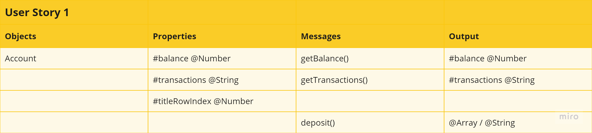
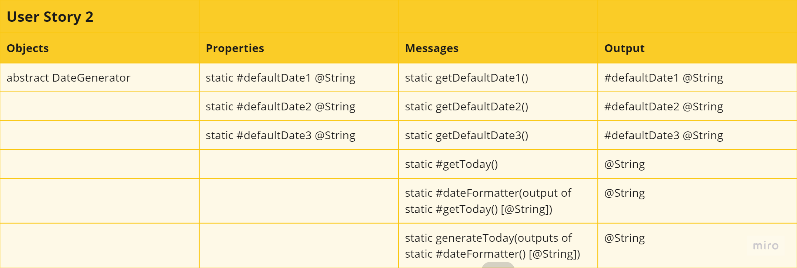
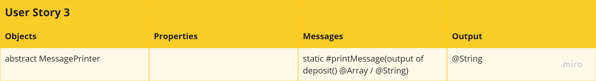
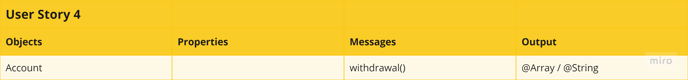
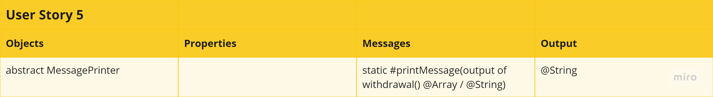
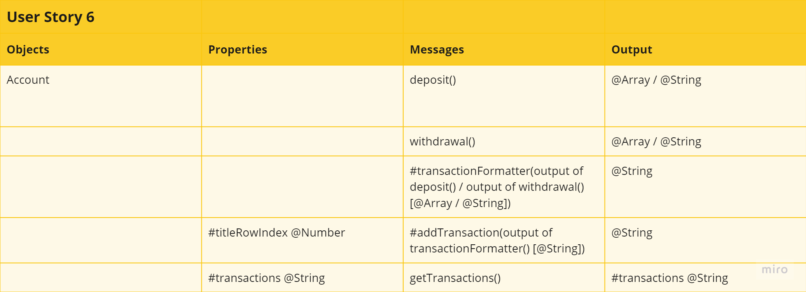

# Domain Models and Test Plan

In light of the client's requirements, six user stories have been identified. To accomplish the goals in the user stories, tests have been designed and conducted to ensure that the production code would deliver the desired outcome. To adhere to the principle of single responsibility, the third party testing framework, Jasmine, has been used in tests where two classes are involved so that tests remain independent, ensuring minimal coupling.

Please see below the user stories listed in bullet points, the domain models created for the stories to describe how the objects use messages to communicate with one another, and the associated tests for the stories. The link to the miro board containing a Kanban board tracking the work progress is also provided [here](https://miro.com/app/board/uXjVKSab-T8=/?moveToWidget=3458764587932867689&cot=14).

## User Stories, Domain Models and Tests

**1. As an account holder, I want to be able to deposit funds, so that I can store the funds in my account.**

| No. | Test                                                                                                                    |
| --- | ----------------------------------------------------------------------------------------------------------------------- |
| 1.1 | Should be an instance of the Account class                                                                              |
| 1.2 | Should have a balance property in an account initialized to 0                                                           |
| 1.3 | Should have a transactions property in an account initialized as an object                                              |
| 1.4 | Should have a deposit method with date and amount as arguments which stores the date and adds the amount to the balance |
| 1.5 | Should only allow a number as amount in the deposit method                                                              |
| 1.6 | Should only allow a positive number in the deposit method                                                               |
| 1.7 | Should only allow an amount which is not falsy in the deposit method                                                    |

**2. As an account holder, I want the dates in the transactions to have a uniform format, so that I will be easy to view.**

| No. | Test                                                                    |
| --- | ----------------------------------------------------------------------- |
| 2.1 | Should have an abstract Date Generator class                            |
| 2.2 | Should be able to generate today's date using the generateToday method  |
| 2.3 | Should be able to get default dates for initialisation of the terminal  |

**3. As an account holder, I want to know whether a deposit is successful, so that I know whether my money has been sent into in my account.**

| No. | Test                                                                       |
| --- | -------------------------------------------------------------------------- |
| 3.1 | Should have an abstract Message Printer class                              |
| 3.2 | Should console log a success message when a deposit is successful          |
| 3.3 | Should have a callback function in the deposit method of the Account class |
| 3.4 | Should console log an unsuccessful message when a deposit is unsuccessful  |

**4. As an account holder, I want to be able to withdraw funds if there is sufficient balance, so that I can use the funds I previously deposited.**

| No. | Test                                                                                                                    |
| --- | ----------------------------------------------------------------------------------------------------------------------- |
| 4.1 | Should have a deposit method with date and amount as arguments which stores the date and adds the amount to the balance |
| 4.2 | Should only allow a number as amount in the withdrawal method                                                           |
| 4.3 | Should only allow a positive amount in the withdrawal method                                                            |
| 4.4 | Should only allow an amount which is not falsy in the withdrawal method                                                 |
| 4.5 | Should only allow a withdrawal if the amount is not larger than the account balance                                     |

**5. As an account holder, I want know whether a withdrawal is successful, so that I will know what happened if I can't access my funds.**

| No. | Test                                                                          |
| --- | ----------------------------------------------------------------------------- |
| 5.1 | Should console log a success message when a withdrawal is successful          |
| 5.2 | Should have a callback function in the withdrawal method of the Account class |
| 5.3 | Should console log an unsuccessful message when a withdrawal is unsuccessful  |

**6. As an account holder, I want to be able to print an account statement in the format as specified in the README file, so that I can use the statements.**

| No. | Test                                                                                                         |
| --- | ------------------------------------------------------------------------------------------------------------ |
| 6.1 | Should have a title row for the transactions in the default terminal display as specified in the README file |
| 6.2 | Should have information of the default deposits ready in the format as specified in the README file          |
| 6.3 | Should have information of the default withdrawal ready in the format as specified in the README file        |
| 6.4 | Should organise the default transactions in the format as specified in the README file                       |

